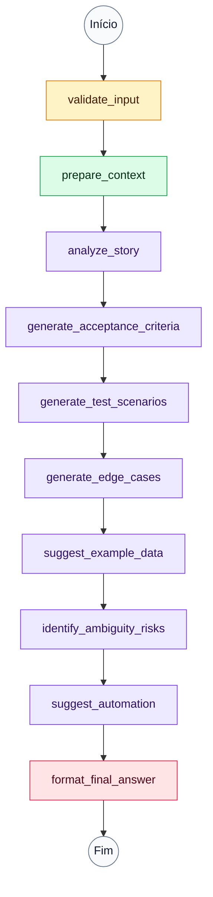

# Test-Plan Agent

Agente de IA para planejar testes manuais e automatizados a partir de histórias de usuário.

Este repositório será desenvolvido como mini-projeto do curso **IA para Desenvolvedores** do **SCTEC**.

## Objetivo inicial

Construir um agente com LangGraph capaz de receber uma história de usuário, analisar o contexto e gerar um plano de testes estruturado com critérios de aceite, cenários principais, casos de borda e sugestões de automação.

## Problema automatizado

Histórias de usuário costumam chegar ao time de desenvolvimento com lacunas, termos ambíguos e pouca clareza sobre critérios de aceite. Isso dificulta a criação de testes manuais e automatizados consistentes.

O Test-Plan Agent automatiza uma primeira análise de testabilidade: ele recebe uma história de usuário, identifica lacunas básicas, consulta uma base local de templates e devolve um plano de testes em Markdown. Quando houver configuração válida de LLM no ambiente, a geração final usa o modelo configurado; sem essa configuração, o agente usa fallback determinístico e informa isso na saída.

## Entrada e saída

Entrada esperada:

```text
Como cliente autenticado, quero consultar meus pedidos recentes para acompanhar a entrega.
```

Saída produzida:

- resumo da história;
- lacunas e ambiguidades;
- critérios de aceite verificáveis;
- cenários principais, alternativos e negativos em Given/When/Then;
- casos de borda;
- dados de exemplo;
- sugestões de automação;
- riscos e observações.

## Funcionamento do agente

O agente usa um `StateGraph` do LangGraph para organizar o fluxo em etapas sequenciais. O estado compartilhado funciona como memória de execução e acumula validações, contexto local, análise da história, critérios, cenários, dados de exemplo, riscos, sugestões de automação, metadados de geração e resposta final.

### Visualização geral

```mermaid
flowchart LR
    user_input[Entrada do usuário<br/>CLI ou arquivo Markdown] --> validate[Validação<br/>conteúdo, ator, ação e valor]
    validate --> context[Ferramenta local<br/>data/test_templates.md]
    context --> graph_state[LangGraph StateGraph<br/>estado como memória]
    graph_state --> llm{LLM configurado?}
    llm -->|sim| plan[Plano de testes<br/>gerado com LLM]
    llm -->|não| fallback[Fallback determinístico<br/>com aviso explícito]
    fallback --> output[Saída reproduzível<br/>critérios, cenários e riscos]
    plan --> output[Saída reproduzível<br/>critérios, cenários e riscos]

    classDef inputClass fill:#dbeafe,stroke:#1d4ed8,color:#172554
    classDef validationClass fill:#fef3c7,stroke:#d97706,color:#451a03
    classDef toolClass fill:#dcfce7,stroke:#16a34a,color:#052e16
    classDef graphClass fill:#ede9fe,stroke:#7c3aed,color:#2e1065
    classDef outputClass fill:#ffe4e6,stroke:#e11d48,color:#4c0519

    class user_input inputClass
    class validate validationClass
    class context toolClass
    class graph_state,llm graphClass
    class plan,output outputClass
    class fallback validationClass
```



### Fluxo de execução



Fluxo principal:

1. validar a história de usuário;
2. preparar contexto local a partir da base de templates;
3. analisar a história e detectar lacunas ou termos ambíguos;
4. gerar critérios de aceite;
5. gerar cenários principais, alternativos e negativos;
6. sugerir casos de borda e dados de exemplo;
7. identificar riscos de ambiguidade;
8. sugerir automação;
9. gerar a resposta final com LLM quando houver configuração válida;
10. usar fallback determinístico com aviso explícito quando não houver configuração de LLM.

## Planejamento

O guia inicial do agente está em [docs/guia-geral-prompt.md](docs/guia-geral-prompt.md). Ele descreve o prompt-base, fluxo com LangGraph, estado recomendado, ferramenta integrada, validações e exemplos de entrada e saída.

## Base local de testes

O fluxo usa uma base local em [data/test_templates.md](data/test_templates.md) como referência controlada para critérios de aceite, cenários Given/When/Then, casos negativos, casos de borda e checklist de testabilidade.

A ferramenta de leitura permite apenas arquivos `.md` e `.txt` dentro da pasta `data/`, com limite de tamanho e erros controlados para caminhos inválidos, arquivos inexistentes, extensões não permitidas e arquivos grandes demais.

## Configuração de LLM

O caminho principal de geração usa OpenAI via `langchain-openai`, integrado ao fluxo LangGraph. Para habilitar geração real com LLM, configure as variáveis no arquivo `.env` local ou no ambiente do terminal:

```env
OPENAI_API_KEY=
OPENAI_MODEL=
OPENAI_BASE_URL=
```

Variáveis esperadas:

- `OPENAI_API_KEY`: chave do provedor. Obrigatória para usar LLM.
- `OPENAI_MODEL`: modelo a ser usado. Opcional; quando ausente, o agente usa `gpt-4o-mini`.
- `OPENAI_BASE_URL`: endpoint compatível com OpenAI. Opcional, útil para provedores compatíveis ou ambientes internos.

Não versione chaves, tokens ou valores reais. Mantenha credenciais apenas em `.env` local ou no gerenciador seguro do ambiente de execução.

### Fallback determinístico

Quando nenhuma variável de LLM estiver configurada, o agente preserva a compatibilidade local e gera o plano pelo caminho determinístico. Nesse caso, a saída final começa com um aviso informando que o fallback foi usado.

O fallback não é usado quando alguma configuração de LLM estiver presente, mas incompleta, inválida ou recusada pelo provedor. Casos como `OPENAI_MODEL` definido sem `OPENAI_API_KEY`, chave inválida, erro de autenticação, erro de autorização, modelo inexistente ou permissão insuficiente geram erro controlado e explícito, sem mascarar o problema.

## Decisões principais

- O projeto usa LLM como caminho principal quando há configuração válida por variáveis de ambiente.
- A geração determinística permanece disponível apenas como fallback por ausência total de configuração de LLM.
- O estado do LangGraph foi usado como memória de execução, mantendo o projeto simples e reproduzível.
- A ferramenta integrada acessa apenas arquivos locais controlados na pasta `data/`, reduzindo riscos de leitura indevida.
- Os exemplos de entrada e saída foram versionados para facilitar avaliação e reprodução.
- A validação automática roda com GitHub Actions em pull requests e pushes para `develop` e `main`.

## Limitações

- A geração do plano não substitui revisão de produto, QA ou pessoas especialistas do domínio.
- O agente só consulta API externa quando um provedor de LLM estiver configurado; sem LLM, usa apenas geração determinística local.
- Sem configuração de LLM, o resultado usa fallback determinístico e tende a ser mais genérico.
- Métricas específicas, regras de negócio detalhadas e critérios de performance precisam ser refinados com o time responsável pelo produto.
- A saída é um ponto de partida para planejamento de testes, não uma garantia de cobertura completa.

## Setup inicial

Este projeto usa Python com `uv` para gerenciamento de ambiente, dependências e execução de comandos.

### Pré-requisitos

- Python 3.12 ou superior.
- `uv` instalado e disponível no terminal.

### Instalação

Na raiz do repositório, execute:

```bash
uv sync
```

Para configurar variáveis de ambiente locais, copie o arquivo de exemplo:

```bash
cp .env.example .env
```

No Windows PowerShell, use:

```powershell
Copy-Item .env.example .env
```

Preencha o arquivo `.env` local apenas com valores reais da sua máquina. Esse arquivo não deve ser versionado.

Para usar LLM, defina ao menos `OPENAI_API_KEY`. Para manter execução local sem LLM, deixe as variáveis de LLM vazias; o fallback determinístico será usado com aviso explícito.

### Execução

O ponto de entrada gera um plano de testes em Markdown com uma história padrão:

```bash
uv run test-plan-agent
```

Também é possível informar uma história pela linha de comando:

```bash
uv run test-plan-agent "Como cliente autenticado, quero consultar meus pedidos recentes para acompanhar a entrega."
```

Também é possível informar um arquivo Markdown com a história:

```bash
uv run test-plan-agent --file examples/input/historia-valida.md
```

Arquivos Markdown também podem conter várias histórias, desde que cada bloco esteja separado por `---`. Nesse caso, o agente gera um plano de testes para cada história encontrada.

No Windows PowerShell:

```powershell
uv run test-plan-agent --file .\examples\input\historia-valida.md
```

Também é possível executar o módulo diretamente:

```bash
uv run python -m test_plan_agent.cli
```

Durante a execução, o CLI escreve mensagens de progresso em `stderr`. A resposta final em Markdown permanece em `stdout`, então redirecionamentos como `> output.md` continuam salvando apenas o plano gerado.

### Exemplos versionados

Entradas de exemplo estão em [examples/input](examples/input) e saídas geradas em Markdown estão em [examples/output](examples/output).

Histórias disponíveis:

- [examples/input/historia-valida.txt](examples/input/historia-valida.txt): história completa para geração do plano principal.
- [examples/input/historia-valida.md](examples/input/historia-valida.md): história completa em Markdown para execução com `--file`.
- [examples/input/historia-ambigua.txt](examples/input/historia-ambigua.txt): história com termos subjetivos detectados como ambíguos.
- [examples/input/historia-incompleta.txt](examples/input/historia-incompleta.txt): requisito incompleto com lacunas de ator e resultado esperado.

Saídas correspondentes:

- [examples/output/plano-historia-valida.md](examples/output/plano-historia-valida.md)
- [examples/output/plano-historia-ambigua.md](examples/output/plano-historia-ambigua.md)
- [examples/output/plano-historia-incompleta.md](examples/output/plano-historia-incompleta.md)

Para reproduzir uma execução com uma entrada versionada no PowerShell:

```powershell
uv run test-plan-agent (Get-Content .\examples\input\historia-valida.txt -Raw)
```

Para reproduzir usando arquivo Markdown:

```powershell
uv run test-plan-agent --file .\examples\input\historia-valida.md
```

### Testes

Execute a suíte principal com:

```bash
uv run pytest
```

## CI

O workflow de CI está em [.github/workflows/ci.yml](.github/workflows/ci.yml). Ele roda em pull requests e pushes para `develop` e `main`, configurando Python, `uv`, instalação travada por lockfile, testes e validações básicas do CLI.

## Apresentação

A apresentação objetiva em até 2 slides está versionada em [docs/apresentacao.md](docs/apresentacao.md).

## GitFlow

O fluxo de branches do projeto está documentado em [docs/gitflow.md](docs/gitflow.md).

## Status

Projeto com grafo LangGraph estruturado, leitura controlada da base local, geração determinística de plano de testes em Markdown, exemplos versionados, testes automatizados e CI configurada.