Mini-projeto avaliativo

# Test-Plan Agent

## Planejamento de testes a partir de histórias de usuário

Histórias de usuário chegam com lacunas, ambiguidade e poucos critérios verificáveis. O agente automatiza a primeira análise de testabilidade e devolve um plano objetivo para QA e desenvolvimento.

	
<strong>Proposta</strong>Transformar requisitos em critérios de aceite, cenários, riscos e sugestões de automação.

	
<strong>Entrada</strong>História de usuário, issue ou requisito funcional, por argumento ou arquivo Markdown.

	
<strong>Saída</strong>Plano de testes estruturado em Markdown.

	

---

Ferramenta e fluxo

# Como o agente funciona

## Fluxo com LangGraph, contexto local e geração final

	
<strong>Processo automatizado</strong>Validar a história, buscar contexto, identificar lacunas e montar o plano de testes.

	
<strong>Ferramenta</strong>Leitura controlada de <code>data/test_templates.md</code>, restrita à pasta <code>data/</code>.

	
<strong>Geração</strong>Usa LLM quando configurado; sem configuração, usa fallback determinístico explícito.

	Validação
	Contexto
	Plano final

	

